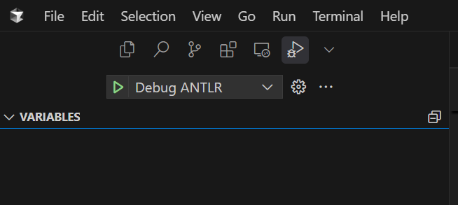
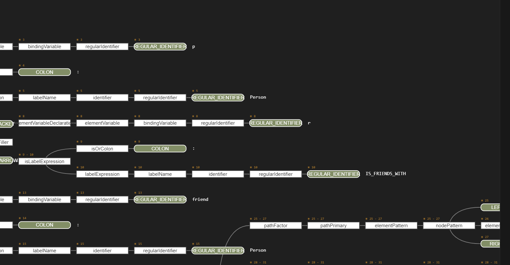

# 準備
1. パッケージのインストール
   注) 本リポジトリは、uvというパッケージマネージャを用いて構築している。ryeやpoetryなどのパッケージマネージャーを
   使っている場合、うまく動作しない場合がある。

   Pythonパッケージマネージャーの[uv](https://docs.astral.sh/uv/)をインストールする．
   ```bash
   # macOSまたはLinuxの場合
   curl -LsSf https://astral.sh/uv/install.sh | sh
   # 実行後、環境変数の設定が即座に反映されない場合は、シェルを開きなおしてください
   # バージョン確認
   uv --version
   ```

   venvを作成する．
   ```bash
   .../antlr4-gql-algebra$ uv sync
   ```

   venvをactivateする
   ```bash
   .../anglr4-gql-alegbra$ . .venv/bin/activate
   ```

# ファイル構成
* `grammar/GQL.g4`: GQL grammar of ANTLR4 from https://github.com/opengql/grammar
* `grammar/[GQLParser.py|GQLLexer.py]`: ANTLR4で自動生成されたパーサ。以下のコマンドで`GQL.g4`から自動生成できる。
```bash
antlr4 -Dlanguage=Python3 GQL.g4
```
* `grammar/GQLListener.py`: 抽象構文木(AST)を走査して処理するリスナーパターンのテンプレートクラスが定義されている。このクラスを継承して、ASTを走査し、代数データ構造なりASTなりを得るロジックを作成する。

* `ExtendedGQLListener.py`: `GQLListener`クラスを継承し、クエリのセマンティックを抽出した代数データ構造を返すロジックを実装(現在進行中)

# ANTLR文法のパース結果の可視化方法
1. [ANTLR4 grammar syntax support](https://marketplace.cursorapi.com/items?itemName=mike-lischke.vscode-antlr4)という拡張機能をインストールする。
1. `sample/`フォルダから、適当なGQLクエリを選択し、vscode内でフォーカスを当てる。

1. 左サイドバーの`debug`バーを開き、``Debug ANTLR`の左側の再生ボタンを押す。すると、パース結果がグラフとして見ることができる。
